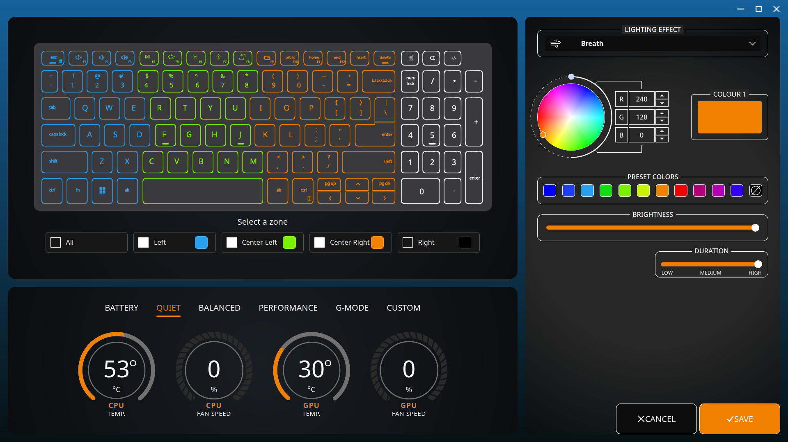

## Open-source Clone of AWCC for Dell G15 5530 (Linux)
A lightweight, high-performance Linux clone of the Windows Alienware Command Center, built specifically for Dell G15 5530 laptops. This application recreates the exact UI/UX layout of the official software, allowing you to manage power/thermal profiles and per-zone AlienFX keyboard lighting natively on Linux.

## Compatibility
For the time being, this app is only compatible with Dell G15 5530, a VID = 0x187C and PID = 0x0551.
Other models hid communication is not implemented yet.

## Architecture & Tech Stack
This application is built for speed and low resource consumption:

* Frontend: React matching the exact layout and look of the Windows AWCC application.
* Desktop Wrapper: Tauri for a secure, ultra-lightweight standalone app experience.
* Backend Core: Written in Python and compiled into a Tauri Sidecar, handling low-level communication with the Linux kernel filesystem (/sys/class).
* Kernel Integration: Leverages the native Linux alienware-wmi module for hardware adjustments. 

## Features 
### Per-zone FX Lighting Control

* Customize keyboard backlight zones directly via system drivers.
* Apply and tweak dynamic lighting effects (static, breathing, pulse, morph, spectrum, rainbow).
* Set different brightness levels on different zones in a single batched update.
* Syncs with the built-in keyboard driver interfaces.

### Real-Time Hardware Monitoring

* Reads live telemetry data straight from /sys/class/hwmon.
* CPU & GPU Temperatures: Live thermal tracking in Celsius.
* CPU & GPU Fan Speeds: Real-time RPM and percentage monitoring.

### Power & Thermal Profiles
Switch between system performance presets via **alienware-wmi** platform-profile driver:

* Battery: Optimizes power saving.
* Quiet: Minimizes fan noise for low-load tasks.
* Balanced: Standard performance for daily use.
* Performance: Boosts clock speeds and fan curves for gaming.
* G-Mode: Maxes out the fans and hardware capabilities for intense sessions. 

## System Requirements & Prerequisites
Before running the application, your Linux kernel must be configured to talk to your Dell hardware.
### 1. Enable Kernel Modules
Ensure the alienware-wmi module is loaded:
```
grep -l "alienware-wmi" /sys/class/platform-profile/platform-profile-*/name | sed 's|/[^/]*$||'
```

### 2. Permissions (Crucial)
Because the Python sidecar reads from and writes to hid device, /sys/class/platform-profile, and /sys/class/hwmon, your user account needs read/write permissions to these paths.
Tip: It is recommended to set up a custom udev rule:

   ```
   sudo touch /etc/udev/rules.d/99-alienware-keyboard.rules
   sudo nano /etc/udev/rules.d/99-alienware-keyboard.rules

   # Paste these two lines and replace platform-profile-0 with the one linked to alienware-wmi
   SUBSYSTEM=="hidraw", ATTRS{idVendor}=="187c", ATTRS{idProduct}=="0551", MODE="0666"
   SUBSYSTEM=="platform-profile", RUN+="/bin/chmod 0666 /sys/class/platform-profile/platform-profile-0/profile"
   
   sudo udevadm control --reload-rules && sudo udevadm trigger
   ```

## Installation & Setup
### For Users (Running the Release)

   1. Download the latest .AppImage, .deb, or .rpm from the Releases page.
   2. Ensure your user has permissions to the /sys paths mentioned above.
   3. Run the application.

## For Developers (Building from Source)
### Prerequisites

* Node.js (v18+)
* Rust & cargo (Required by Tauri)
* Python 3.10+ & pip (For building the sidecar)

### Build Steps

   1. Clone the repository:
   ```
   git clone https://github.com/m4r0uanEkha/g15-command-center-linux.git
   ```

   2. Compile the Python backend into a Tauri sidecar:
   ```
   cd g15-command-center-linux/controller

   python3 -m venv .venv
   
   source .venv/bin/activate
   
   pip install -r requirements.txt
   
   pyinstaller --onefile backend.py -n main-x86_64-unknown-linux-gnu

   mv dist/main-x86_64-unknown-linux-gnu ../interface/src-tauri/binaries/
   ```

   3. Install frontend dependencies:
   ```
   cd ../interface
   npm install
   ```

   4. Run the application in development mode:
   ```
   npm run tauri dev
   ```

   5. Build the production package:
   ```
   npm run tauri build
   ```

## Contributing
Contributions are welcome! If you want to add compatibility to other models, optimize the Python sidecar parsing logic, add more udev rule templates, or enhance the React UI.

## Disclaimer
This is an open-source, third-party project. It is not affiliated with, authorized, maintained, or endorsed by Dell, Alienware, or the Linux kernel team. Modifying hardware profiles and fan speeds carries inherent risks. Use this software at your own risk.